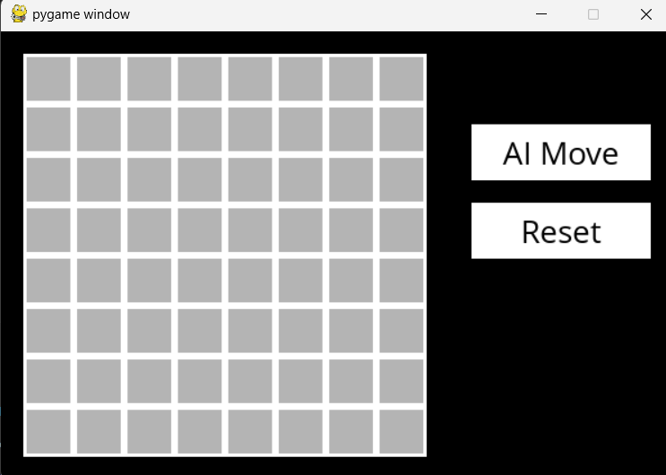
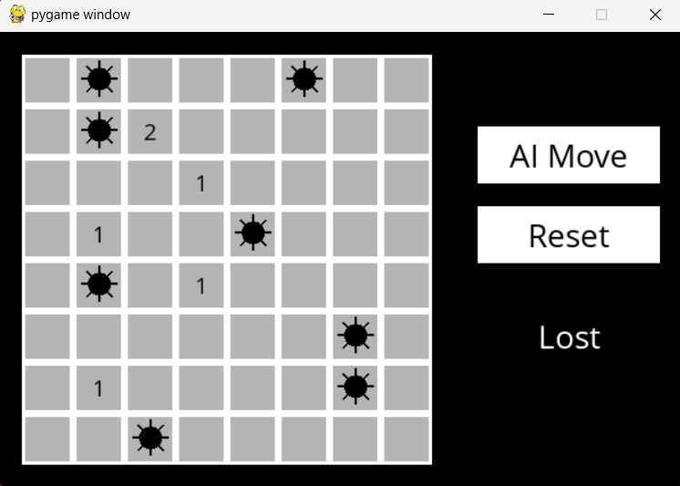

# Minesweeper with AI Agent

A Minesweeper game built with Python and Pygame that includes an intelligent AI agent to help you find the best moves.

## Overview

This project implements a classic Minesweeper game with a graphical interface and an AI assistant that uses logical deduction to determine safe cells to reveal. The AI doesn't guarantee a win, but it provides the best possible move based on available information.

## Features

- **Interactive GUI** - Clean and intuitive Pygame-based interface
- **AI Agent Assistance** - Click "AI Move" to get the AI's recommended next move
- **Smart Logic** - The AI uses logical deduction to find safe cells
- **Game Status** - Visual feedback for wins and losses
- **Customizable Board** - Default 8×8 board with 8 mines

## Game Controls

| Action | Control |
|--------|---------|
| Reveal cell | Left Click |
| Flag mine | Right Click |
| Get AI Agent suggestion | Click "AI Move" button |
| Start over | Click "Reset" button |

## Game Board

When you start a new game, you'll see the initial cell layout:



When you loose, you encounter something like this


## Prerequisites
- Python 3.x
- pip (Python package manager)

### Setup

1. Clone or download this repository
2. Navigate to the project directory
3. Install dependencies:

```bash
pip install -r requirements.txt
```

## Running the Game

```bash
python runner.py
```

The game will launch with an instructions screen. Click "Play Game" to begin!

## How the AI Works

The AI agent uses constraint satisfaction and logical deduction to:
1. Identify cells that are guaranteed to be safe based on mine counts
2. Identify cells that are guaranteed to be mines based on surrounding constraints
3. Make probabilistic decisions when logic alone isn't sufficient
4. Return the safest move available

**Note:** The AI provides the best move based on current information, but since Minesweeper can involve luck, it doesn't guarantee a **win** on every game.

## Game Rules

1. **Mark all mines to win** - Successfully flag all mines on the board
2. **Hit a mine then you lose** - Clicking on a mine ends the game
3. **Numbers indicate nearby mines** - Each revealed cell shows how many mines are in the 8 surrounding cells
4. **Use the AI wisely** - When stuck, ask the AI for the safest next move

## Requirements

- `pygame` - For the graphical interface and game rendering

See [requirements.txt](requirements.txt) for exact version specifications.

## Project Structure

```
minesweeper/
├── minesweeper.py      # Game logic and AI agent implementation
├── runner.py           # Pygame GUI and game loop
├── requirements.txt    # Python dependencies
├── assets/
│   ├── fonts/         # Game fonts
│   └── images/        # Game graphics
└── README.md          # This file
```

## Tips for Playing

- Start in the corners or edges - they have fewer adjacent cells
- Use the AI Move button when you're stuck to learn the logic
- Flag mines as you identify them to keep track of danger zones
- Numbers are your friend - use them to deduce safe and unsafe cells

Enjoy the game and good luck! 🎮
